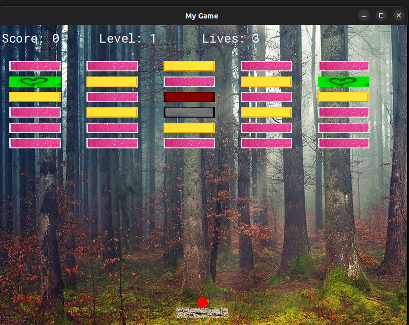
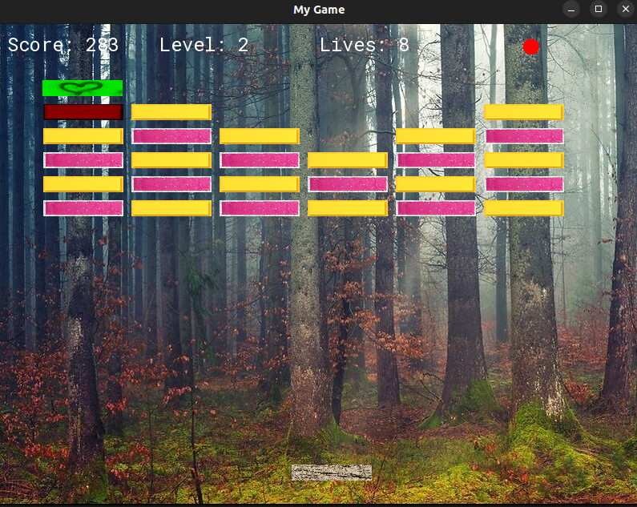

Welcome to the GitHub repository showcasing our Breakout game project implemented in C++! This repository is dedicated to presenting the Breakout game that we developed as a team, combining our skills and creativity to create an enjoyable gaming experience.

**Project Overview**

As part of our collaborative efforts, we embarked on developing a Breakout game using the C++ programming language. The Breakout game is a classic arcade game where players control a paddle to bounce a ball and break bricks. Our goal was to implement an engaging and visually appealing version of the game while incorporating essential gaming concepts and mechanics.

**Key Features**

Our Breakout game project offers the following key features:

1. Interactive Gameplay: Experience an interactive and immersive gaming environment where players control a paddle to prevent a ball from falling off the screen while breaking bricks.
2. Classic Breakout Mechanics: We implemented the core mechanics of the Breakout game, including ball movement, collision detection, paddle control, brick destruction, and scoring.
3. Graphics and Visual Effects: Our game features visually appealing graphics, vibrant colors, and exciting visual effects to enhance the overall gaming experience.
4. Level Design: We designed multiple levels with varying degrees of difficulty and introduced power-ups and obstacles to add depth and challenge to the gameplay.
5. Sound Effects and Music: We incorporated sound effects and background music to create an engaging auditory experience, further immersing players in the game.
6. User Interface: Our game includes a user-friendly interface, displaying game information such as score, lives remaining, and level progression.

